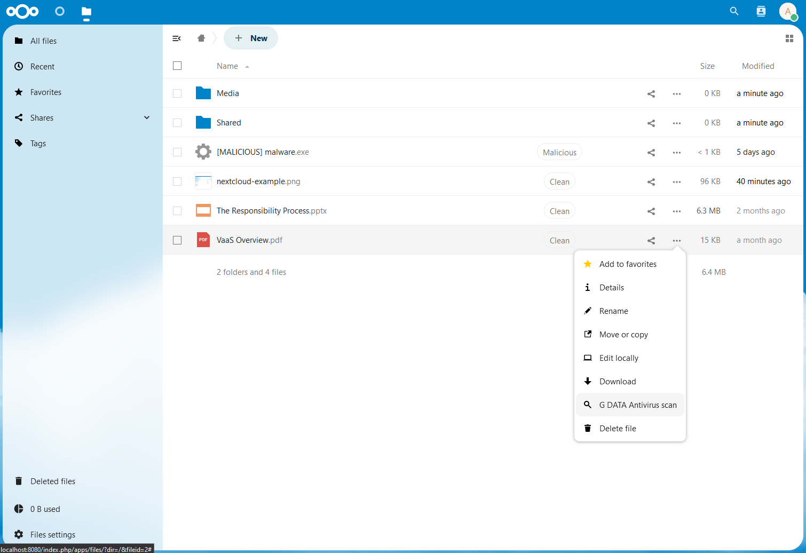

<!--
SPDX-FileCopyrightText: Lennart Dohmann <lennart.dohmann@gdata.de>
SPDX-License-Identifier: CC0-1.0
-->

# G DATA Verdict-as-a-Service



## Introduction

Welcome to the G DATA Verdict-as-a-Service (VaaS) integration for Nextcloud. This project aims to provide an additional layer of security to your Nextcloud instance by enabling automatic and manual scanning of files for malicious content.

VaaS scans files and tags them with either `Clean` or `Malicious` verdicts, providing users with immediate feedback about the safety of their files. Unscanned files are tagged as `Unscanned` and queued for background scanning.

Verdict-as-a-Service is a cloud-based service provided by G DATA CyberDefense AG. It is designed to work on your own infrastructure as a self-hosted variant, ensuring a high level of security and privacy. If you are interested in using VaaS on-premise or have any questions, please contact vaas@gdata.de for more information or check out the [repository of our helm chart](https://github.com/GDATASoftwareAG/vaas-helm) for self-hosting the VaaS backend.

In the settings page of the Nextcloud app, you can create a free account to use G DATA's cloud-based service if self-hosting is not an option for you. The free account allows you to scan up to 10.000 files per month. No matter if you use the cloud-based service or the self-hosted variant, all files are scanned in a secure and privacy-friendly way. No file content is stored on the VaaS backend and all communication is encrypted. G DATA CyberDefense AG is a German company and therefore subject to the strict German and European data protection laws.

This project is licensed under the GNU Affero General Public License. For more details, please see the [LICENSES/AGPL-3.0-or-later.txt](LICENSES/AGPL-3.0-or-later.txt) file.

Please read on for information about setting up a development environment and contributing to the project.

## Setting up a development environment

### Windows
For Windows you can also just start the docker-compose.yaml or the powershell script ```start-dev-environment.ps1```

### Linux
* For a quick development environment you can use the provided ```start-dev-environment.sh``` script. Or you use the following steps:
* Make sure you have docker compose installed
* Run the following command with bash in the folder where you want your Nextcloud in
```bash
git clone https://github.com/juliushaertl/nextcloud-docker-dev
cd nextcloud-docker-dev
./bootstrap.sh
sudo sh -c "echo '127.0.0.1 nextcloud.local' >> /etc/hosts"
docker-compose up nextcloud proxy
```
The command may take a while and starts Nextcloud directly. Nextcloud can then be accessed with your browser at http://nextcloud.local.

In the future, Nextcloud can then be started again by changing to the
folder "nextcloud-docker-dev" and running ```docker compose up nextcloud proxy```. For more information see the [Nextcloud app development tutorials](https://cloud.nextcloud.com/s/iyNGp8ryWxc7Efa). These steps set up the official Nextcloud Dev Environment. It uses an SQLite databse. If you want to test on a Postgres you can set up a real Nextcloud Server using this [compose file](compose.yaml):
```yaml
services:
  db:
    image: postgres
    restart: unless-stopped
    environment:
      POSTGRES_DB: nextcloud
      POSTGRES_USER: nextcloud
      POSTGRES_PASSWORD: nextcloud
    volumes:
      - db:/var/lib/postgresql/data

  app:
    image: nextcloud:production
    ports:
      - "8080:80"
    restart: unless-stopped
    links:
      - db
    volumes:
      - nextcloud:/var/www/html
    environment:
      - POSTGRES_DB=nextcloud
      - POSTGRES_USER=nextcloud
      - POSTGRES_PASSWORD=nextcloud
      - POSTGRES_HOST=db

volumes:
  db:
  nextcloud:
```
