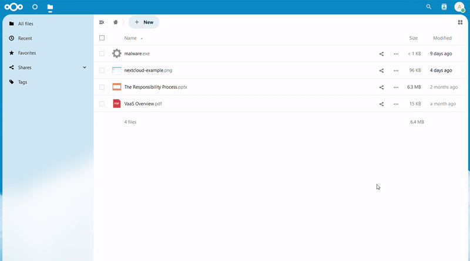

<!--
SPDX-FileCopyrightText: Lennart Dohmann <lennart.dohmann@gdata.de>
SPDX-License-Identifier: CC0-1.0
-->

# G DATA Antivirus for Nextcloud



## Introduction

Welcome to the G DATA Verdict-as-a-Service (VaaS) integration for Nextcloud. This project aims to provide an additional layer of security to your Nextcloud instance by enabling automatic and manual scanning of files for malicious content.

VaaS scans files and tags them with either `Clean` or `Malicious` verdicts, providing users with immediate feedback about the safety of their files. Unscanned files are tagged as `Unscanned` and queued for background scanning.

Verdict-as-a-Service is a cloud-based service provided by G DATA CyberDefense AG. It is designed to work on your own infrastructure as a self-hosted variant, ensuring a high level of security and privacy. If you are interested in using VaaS on-premise or have any questions, please contact vaas@gdata.de for more information or check out the [repository of our helm chart](https://github.com/GDATASoftwareAG/vaas-helm) for self-hosting the VaaS backend.

In the settings page of the Nextcloud app, you can create a free account to use G DATA's cloud-based service if self-hosting is not an option for you. No matter if you use the cloud-based service or the self-hosted variant, all files are scanned in a secure and privacy-friendly way. No file content is stored on the VaaS backend and all communication is encrypted. G DATA CyberDefense AG is a German company and therefore subject to the strict German and European data protection laws.

This project is licensed under the GNU Affero General Public License. For more details, please see the [LICENSES/AGPL-3.0-or-later.txt](LICENSES/AGPL-3.0-or-later.txt) file.

Please read on for information about setting up a development environment and contributing to the project.

## Features

- **Automatic file scanning:** Files from users are automatically scanned 24/7 in the background.
- **Protection during upload:** Files are scanned during upload and tagged with a verdict.
- **Manual scanning:** Users can manually scan files at any time.
- **Nextcloud Activities:** The behavior of the antivirus can be tracked in the Activities app through smart logging.
- **File tagging:** Files are tagged with a verdict, providing immediate feedback to users.
- **No additional software required:** The app works out of the box with the G DATA VaaS cloud service.
- **Scanning rules:** The app offers both a block list and an allow list to easily set what should and should not be scanned.
- **Quarantine:**  If malicious files are already found in an existing Nextcloud environment, they can be moved to a quarantine area of the affected user.

## Tags

- **Clean:** The scanners did not find any malicious content in the file.
- **Malicious:** The scanners found a virus or other malicious content in the file.
- **Pup:** The scanners found a potentially unwanted program in the file. Could be adware, spyware, etc.
- **Unscanned:** The file has not been scanned yet.
- **Won't Scan:** The file is not scanned because it is too large or in a format that cannot be scanned.

## Settings

The app offers a variety of settings to customize the behavior of the antivirus. The settings can be found in the Nextcloud admin settings page under the "Verdict-as-a-Service" section.

- **Authentication Method:** If you have created your own account on https://vaas.gdata.de/login, select 'Resource Owner Password Flow' here. If you have received access data from your provider (Client ID and Secret), select 'Client Credentials Flow'. You can simply leave the other fields empty.
- **Scan only this:** Equivalent to an allowlist. If the values here are separated by commas, e.g. "Documents, .exe, Scan", only those containing the corresponding values in the path are scanned. In this example, *.exe files and the contents of the Documents/ and Scan/ folders would be scanned.
- **Do not scan this:** Equivalent to a blocklist. If there are values separated by commas, e.g. "Documents, .exe, Scan", these are not scanned.time until all files are scanned. Recommended are values between 10 and 100.
- **Advanced Settings:** The token endpoint and the VaaS URL determine the scan backend. By default, the public G DATA Cloud is used for scanning. If the VaaS backend is self-hosted, the corresponding values for the self-hosted instance must be entered here.

## Self-hosting the scanning backend (VaaS)

If you want to self-host the scanning backend, take a look at the [repository of our helm chart](https://github.com/GDATASoftwareAG/vaas-helm).

## Nextcloud Commands

The following commands are available for managing and interacting with the G DATA VaaS app in your Nextcloud instance:

#### `gdatavaas:scan`

- **Description**: Scans files for malware.
- **Usage**: `php occ gdatavaas:scan`
- **Docker Usage**: `docker exec --user www-data nextcloud-container php occ gdatavaas:scan`
- **Details**: This command scans all files in the Nextcloud instance for malware and logs the results.

#### `gdatavaas:get-tags-for-file`

- **Description**: Retrieves tags for a specified file.
- **Usage**: `php occ gdatavaas:get-tags-for-file <file-path>`
- **Docker Usage**: `docker exec --user www-data nextcloud-container php occ gdatavaas:get-tags-for-file <file-path>`
- **Arguments**:
   - `<file-path>`: The path to the file (e.g., `username/files/filename`).
- **Details**: This command fetches and logs all tags associated with the specified file.

#### `gdatavaas:remove-tag`

- **Description**: Deletes a specified tag.
- **Usage**: `php occ gdatavaas:remove-tag <tag-name>`
- **Docker Usage**: `docker exec --user www-data nextcloud-container php occ gdatavaas:remove-tag <tag-name>`
- **Arguments**:
   - `<tag-name>`: The name of the tag to delete.
- **Details**: This command removes the specified tag from the system. If the tag does not exist, an error is logged.

#### `gdatavaas:tag-unscanned`

- **Description**: Tags all files without a tag from this app as unscanned.
- **Usage**: `php occ gdatavaas:tag-unscanned`
- **Docker Usage**: `docker exec --user www-data nextcloud-container php occ gdatavaas:tag-unscanned`
- **Details**: This command tags all files that have not been tagged by the G DATA VaaS app as "unscanned" and logs the results.

#### `gdatavaas:get-tag-id`

- **Description**: Gets the ID of a specified tag.
- **Usage**: `php occ gdatavaas:get-tag-id <tag-name>`
- **Docker Usage**: `docker exec --user www-data nextcloud-container php occ gdatavaas:get-tag-id <tag-name>`
- **Arguments**:
   - `<tag-name>`: The name of the tag to get the ID for.
- **Details**: This command retrieves and logs the ID of the specified tag. If the tag does not exist, an error is logged.

## Setting up a development environment

Before you start, make sure you have the following tools installed:

- [Docker](https://www.docker.com/)
- [Docker Compose](https://docs.docker.com/compose/)
- [Composer](https://getcomposer.org/)
- [Node.js](https://nodejs.org/en/)
- [npm](https://www.npmjs.com/)

Also, you need to make an ```npm install```, ```npm run build``` and ```composer install``` to install dependencies and build the node modules.
You always need to do this before you start the development environment or copy the app to your Nextcloud instance manually.
If you copy the app directory manually in your Nextcloud instance you have to rename the folder to ```gdatavaas```. 

### Windows
For Windows, you can also just start the docker-compose.yaml or the powershell script ```start-dev-environment.ps1```

### Linux
* For a quick lite development environment you can use the provided ```start-dev-environment.sh``` script. Or you use the following steps:
* Make sure you have the tools mentioned above installed.
* With the provided ./install.sh script you can install the dependencies and build the node modules.

### `install.sh` Script

The `install.sh` script is used to set up and configure a Nextcloud instance with the G DATA VaaS app and Smtp4Dev. Below is an explanation of the script's features:

1. **Environment Variables in `.env-local`**:
    - `CLIENT_ID`: Sets the client ID for the G DATA VaaS app.
    - `CLIENT_SECRET`: Sets the client secret for the G DATA VaaS app.
   
   If you want to use the ResourceOwnerPasswordFlow you have to set these settings manually in the Nextcloud settings after the installation.

2. **Specify the Nextcloud server version**:
    - The Nextcloud version defaults to 30.0.0
    - You can start the `install.sh` script with the desired Nextcloud version as an argument, e.g. `./install.sh 30`

3. **Smtp4Dev**:
    - Starts a container with the Smtp4Dev tool to capture emails sent by Nextcloud.
    - The tool is accessible at `http://localhost:8081` and can be used to view emails sent by Nextcloud.

4. **Additional Install Script**:
    - Sources `install.local` if it exists for any additional installation steps.


### Useful commands

| Description               | Command                                                                                                  |
|---------------------------|----------------------------------------------------------------------------------------------------------|
| Trigger cronjobs manually | `docker exec --user www-data nextcloud-container php /var/www/html/cron.php`                             |
| Upgrade Nextcloud via CLI | `docker exec --user www-data nextcloud-container php occ upgrade`                                        |
| Watch logs                | `docker exec --user www-data nextcloud-container php occ log:watch`                                      |
| Watch raw logs            | `docker exec --user www-data nextcloud-container php occ log:watch --raw \| jq .message`                 |
| Set log level to debug    | `docker exec --user www-data nextcloud-container php occ log:manage --level DEBUG`                       |


## Smtp4Dev

For more information about Smtp4Dev, please refer to the [official README](https://github.com/rnwood/smtp4dev/blob/master/README.md).


### Configuring via the command line

In addition to the graphical configuration via the VaaS settings page in Nextcloud, configuration is possible via PHP OCC commands:

```
# The authentication flow to use (depends on available credentials). Default: ResourceOwnerPassword
php occ config:app:set gdatavaas authMethod <ResourceOwnerPassword|ClientCredentials>

# Username + Password are used only in ResourceOwnerPassword authMethod
php occ config:app:set gdatavaas username <string>
php occ config:app:set gdatavaas password <string>

# ClientID + ClientSecret are used only in ClientCredentials authMethod
php occ config:app:set gdatavaas clientId <string>
php occ config:app:set gdatavaas clientSecret <string>

# VaaS server address. Default: wss://gateway.staging.vaas.gdatasecurity.de
php occ config:app:set gdatavaas vaasUrl <URL>
# Authentication server. Default: https://account-staging.gdata.de/realms/vaas-staging/protocol/openid-connect/token
php occ config:app:set gdatavaas tokenEndpoint <URL>

# Name of quarantine folder. Default: Quarantine
php occ config:app:set gdatavaas quarantineFolder <string>
# Whether to enable the automatic file scan. Default: false
php occ config:app:set gdatavaas autoScanFiles <true|false>
# Whether to add a prefix to malicious files. Default: false
php occ config:app:set gdatavaas prefixMalicious <true|false>
# Whether to disable the unscanned tag. Default: false
php occ config:app:set gdatavaas disableUnscannedTag <true|false>
# Comma-separated list of files/folders that should be scanned. Default: Empty string (all files)
php occ config:app:set gdatavaas scanOnlyThis <string>
# Comma-separated list of files/folders that should **not** be scanned. Default: Empty string (no files excluded)
php occ config:app:set gdatavaas doNotScanThis <string>
# Email address to send notifications to, when infected files are uploaded. Default: None
php occ config:app:set gdatavaas notifyMail <email>
# Whether to send email notifications on upload, when files are infected. Default: false
php occ config:app:set gdatavaas sendMailOnVirusUpload <true|false>
# Whether to send a weekly summary of malicious files to an administrator. Default: false
php occ config:app:set gdatavaas notifyAdminEnabled <true|false>
```

You can also install and/or update the app via OCC:

```
# Install
php occ app:install gdatavaas
# Upgrade
php occ app:update gdatavaas
```
